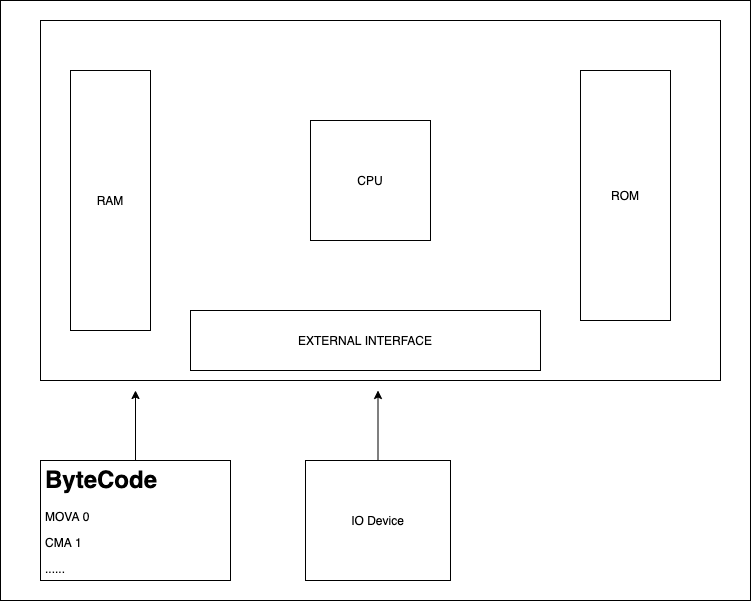
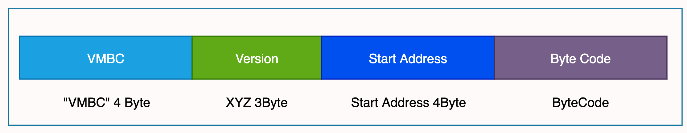

# OPEN VM Design Document

## VM Specific

### RAM

**_4KB_** - **_4GB_**

### Register

**_293_** Registers.

### Stack

**_8(layer)_** , **_32(Register)_** deepth Stack.

## VM Model

### Basic Structure

The open ohvm is a virtual CPU simulator,It contains RAM,CPU,External Interface,like picture at bellow:



### Memory Distributed

1. Program address
   Program address default is **_0x0H_**
2. MAIN address
   MAIN address default is **_0x0H_**,You can use **_START_** label assign main address

```assembly
START:
    MAIN 0H
END
```

##### _Notice:_

> **_0x0H_** is a abslute address, it's real address is **_1025_**.

### Register Distributed

Those address can't be accessed by user program.

| Name                 | Symbol    | Size       | Address(Decimal) |
| -------------------- | --------- | ---------- | ---------------- |
| NullPtr Register     | NULL      | 1byte      | ROM: 0 - 1       |
| VM Flag Register     | FLAG      | 1byte      | ROM: 1 - 2       |
| Addressing Register  | A         | 4byte      | ROM: 3 - 5       |
| ACCumulator          | ACC       | 4byte      | ROM: 6 - 9       |
| Program counter      | PC        | 4byte      | ROM: 10 - 13     |
| Stack index pointer  | SP        | 4byte      | ROM: 14 - 17     |
| Stack deepth pointer | SD        | 4byte      | ROM: 18 - 21     |
| Exception Register   | EXCPT     | 4byte      | ROM: 22 - 25     |
| General Register     | R{0...31} | 4byte(per) | ROM: 25 - 152    |
| Stack Register       | S{0...7}  | 4byte(per) | ROM: 153 - 378   |

### Flags

| Name      | Symbol | Size |
| --------- | ------ | ---- |
| Zero      | ZE     | 1bit |
| Equal     | EQ     | 1bit |
| Execption | EX     | 1bit |
| Reserved  | --     | 1bit |
| Reserved  | --     | 1bit |
| Reserved  | --     | 1bit |
| Reserved  | --     | 1bit |
| Reserved  | --     | 1bit |

### Instructions Specific

| Instruction Code | UNFIXED LENGTH segment |
| ---------------- | ---------------------- |
| 1 Byte           | Other segment          |

### Instructions Set

| Instruction Code | Symbol                | Example                               | Function                                             |
| ---------------- | --------------------- | ------------------------------------- | ---------------------------------------------------- |
| 0X0000           | NOP                   | NOP                                   | No operation, used for delay                         |
| 0X0001           | START                 | START                                 | Start ohvm                                           |
| 0X0002           | STOP                  | STOP                                  | Stop ohvm                                            |
| 0X0003           | RSTR                  | RSTR                                  | Reset all Register                                   |
| 0X0004           | TIMER [Rn]            | MOVR R0 #5<br>TIMER R0                | Start Timer                                          |
| 0X0005           | GOTO [Rn]/[Label]     | GOTO LOOP<br>GOTO R0                  | GOTO ADDress                                         |
| 0X0006           | CALL [Rn]/[Label]     | CALL LOOP<br>CALL R0                  | CALL SUB process                                     |
| 0X0007           | BACK                  | BACK                                  | RETURN from SUB process                              |
| 0X0008           | JMP [Rn]/[Label]      | JMP LOOP                              | JUMP Address With No Condition                       |
| 0X0009           | JZ [ACC] [Rn]/[Label] | JZ LOOP                               | Compare with ACC, Jump Address if Zero Flag == 1     |
| 0X000A           | JE [ACC] [Rn]/[Label] | JE LOOP                               | Compare with ACC, Jump Address if Equal Flag == 1    |
| 0X000B           | JX [ACC] [Rn]/[Label] | JX LOOP                               | Compare with ACC, Jump Address if Excepion Flag == 1 |
| 0X000C           | CMRAE [Rn]            | MOV R0 #1<br>CMRAE                    | COMPARE R{x} if equal ACC                            |
| 0X000D           | CMRAG [Rn]            | MOV R0 #1<br>CMRAG                    | COMPARE R{x} if greater than ACC                     |
| 0X000E           | CMRAL [Rn]            | MOV R0 #1<br>CMRAL                    | COMPARE R{x} if little than ACC                      |
| 0X000F           | CMRRE [Rn] [Rn]       | MOV R0 #1<br>MOV R1 #1<br>CMRRE R0 R1 | COMPARE R{x} if equal R{x}                           |
| 0X0010           | CMRRG [Rn] [Rn]       | MOV R0 #1<br>MOV R1 #1<br>CMRRG R0 R1 | COMPARE R{x} if greater than R{x}                    |
| 0X0011           | CMRRL [Rn] [Rn]       | MOV R0 #1<br>MOV R1 #1<br>CMRRL R0 R1 | COMPARE R{x} if little than R{x}                     |
| 0X0012           | CMASE [Rn] [Sn]       | CMASE R0 S0                           | COMPARE ACC if equal than Stack                      |
| 0X0013           | CMASG [Rn] [Sn]       | CMASG R0 S0                           | COMPARE ACC if greater than Stack                    |
| 0X0014           | CMASL [Rn] [Sn]       | CMASL R0 S0                           | COMPARE ACC if little than Stack                     |
| 0X0015           | CMRSE [Rn] [Sn]       | CMRSE R0 S0                           | COMPARE R{x} if little than Stack                    |
| 0X0016           | CMRSG [Rn] [Sn]       | CMRSG R0 S0                           | COMPARE R{x} if greater than Stack                   |
| 0X0017           | CMRSL [Rn] [Sn]       | CMRSL R0 S0                           | COMPARE R{x} if little than Stack                    |
| 0X0018           | INCA                  | INCA                                  | INCREASE ACC                                         |
| 0X0019           | DECA                  | DECA                                  | DECREASE ACC                                         |
| 0X001A           | INCR [Rn]             | INCR R0                               | INCREASE Register{x}                                 |
| 0X001B           | DECR [Rn]             | DECR R0                               | DECREASE Register{x}                                 |
| 0X001C           | ADDAR [Rn]            | MOV R0 #1<br>ADDAR R0                 | ADD ACC and Register{x}                              |
| 0X001D           | SUBAR [Rn]            | MOV R0 #1<br>SUBAR R0                 | SUB ACC and Register{x}                              |
| 0X001E           | INCS                  | INCS                                  | INCREASE Stack                                       |
| 0X001F           | DECS                  | DECS                                  | DECREASE Stack                                       |
| 0X0020           | ADDAS [Sn]            | ADDAS S0                              | ADD ACC and Stack                                    |
| 0X0021           | SUBAS [Sn]            | SUBAS S0                              | SUB ACC and Stack                                    |
| 0X0022           | ANDR [Rn]             | MOV R0 #1<br>ANDR R0                  | ACC AND Register{x}                                  |
| 0X0023           | AOR [Rn]              | MOV R0 #1<br>AOR R0                   | ACC OR Register{x}                                   |
| 0X0024           | AXR [Rn]              | MOV R0 #1<br>AXR R0                   | ACC XOR Register{x}                                  |
| 0X0025           | BSLR [Rn]             | MOV R0 #1<br>BSLR R0                  | BIT Shift left in Register{x}                        |
| 0X0026           | BSRR [Rn]             | MOV R0 #1<br>BSRR R0                  | BIT Shift right in Register{x}                       |
| 0X0027           | BSLLR [Rn]            | MOV R0 #1<br>BSLLR R0                 | BIT Shift left loop in Register{x}                   |
| 0X0028           | BSRLR [Rn]            | MOV R0 #1<br>BSRLR R0                 | BIT Shift right loop in Register{x}                  |
| 0X0029           | ANDS [Sn]             | ANDS S0                               | ACC AND Stack                                        |
| 0X002A           | AOS [Sn]              | AOS S0                                | ACC OR Stack                                         |
| 0X002B           | AXS [Sn]              | AXS S0                                | ACC XOR Stack                                        |
| 0X002C           | BSLS [Sn]             | BSLS S0                               | BIT Shift left in Stack                              |
| 0X002D           | BSRS [Sn]             | BSRS S0                               | BIT Shift right in Stack                             |
| 0X002E           | BSLLS [Sn]            | BSLLS S0                              | BIT Shift left loop in Stack                         |
| 0X002F           | BSRLS [Sn]            | BSRLS S0                              | BIT Shift right loop in Stack                        |
| 0X0030           | IMA #[Hex]            | IMA #1                                | Immediately value to ACC                             |
| 0X0031           | IMR [Rn] #[Hex]       | IMR R0 #1                             | Immediately value to Register                        |
| 0X0032           | IMS [Sn] #[Hex]       | IMS S1 #1                             | Immediately value to Stack                           |
| 0X0033           | GET [Rn]              | GET R1                                | Get value from address                               |
| 0X0034           | MVRR [Rn] [Rn]        | MVRR R0 R0                            | MOVE Register value to another Register{x}           |
| 0X0035           | MVRS [Rn] [Sn]        | MVRS R0 S0                            | MOVE Register value to Stack                         |
| 0X0036           | MVSR [Rn] [Rn]        | MVRS S0 R0                            | MOVE Stack value to Register                         |
| 0X0037           | MVAR [Rn]             | MVAR R0                               | MOVE ACC value to Register                           |
| 0X0038           | INTK                  | INTK                                  | Wait key interupt                                    |
| 0X0039           | KEY                   | KEY                                   | Get key                                              |
| 0X003A           | PLY [Rn]              | MOV R0 #1<br>PLY R0                   | Play dididi sound                                    |
| 0X003B           | PLYS [Rn]             | MOV R0 #1<br>PLYS R0                  | Play a series of sound.Usually have a frequence      |
| 0X003C           | GSET [Rn]             | MOV R0 #1<br>GSET R0                  | Graphics resolution setting, [64X32 - 640X320]       |
| 0X003D           | CLS                   | CLS                                   | Clear screen                                         |
| 0X003E           | DPXY [Rn]             | MOV R0 #1<br>DPXY R0                  | Draw 8 \* x pixels at (x, y)                         |
| 0X003F           | DXY [Rn]              | MOV R0 #1<br>DXY R0                   | Draw point at (x, y)                                 |
| 0X0040           | DCXY [Rn]             | MOV R0 #1<br>DCXY R0                  | Draw char at (x, y)                                  |
| 0X0041           | DLINE [Rn]            | MOV R0 #1<br>DCXY R0                  | Draw line                                            |
| 0X0042           | DRECT [Rn]            | MOV R0 #1<br>DCXY R0                  | Draw rectangle                                       |
| 0X0043           | SCRU                  | SCRU                                  | Screen scrool up x pixel                             |
| 0X0044           | SCRD                  | SCRD                                  | Screen scrool down x pixel                           |
| 0X0045           | SCRL                  | SCRL                                  | Screen scrool left x pixel                           |
| 0X0046           | SCRR                  | SCRR                                  | Screen scrool right x pixel                          |
| 0X0047           | SET [Rn]              | SET R0                                | Set value to ram                                     |

##### _Notice:_

> All instruction return value is store in passtive side. Such `MOVSR {Rx}` means move stack value to register ,passtive side is register.But in `INCA` means ACC increase 1 and return value to ACC.

## VM Program Specific

### Reserved Keywords

- **_START_**: used for start ohvm
- **_MAIN_**: main like c
- **_END_**: sub process end label
- **_STOP_**: stop ohvm

##### _Notice:_

> <div style="color:red">Can't use those words in user program!</div>

### Program text format

```assembly
START:
    MAIN 0H
END

MAIN:
    ;;
END

SUB1:
   ;;
END

SUB2:
   ;;
END

STOP
```

## Program Example

```assembly
;; Example program
START:
    MAIN 00H ;; program start at 0H
END
;; main
MAIN:
    IA 0              ;; ACC = 0
    IR R0 #1          ;; R0 = 1
    ADDAR R0          ;; ACC = ACC + R0
    CALL DISPLAY      ;; Call display
    STOP              ;;
END
;; display sub process
DISPLAY:
    DCXY 40, 50, ACC ;; Display value in ACC
END

STOP
```

## Exception

Can use `TRY ... CATCH` expression to catch exceptions.

```
TRY
    ;; ....
    ;; ....
    ;; ....
CATCH ${Address}
```

When exception catched, the `EX` flag be seted and `EXCPT` register be seted exception code.

## VM Byte Code Specific

Byte Code header contains 4byte file type,and 3byte version,4byte address:



## Program Compiler

- https://github.com/ssloth/OpenVM-AS

### How to use

```shell
# oohvmcc file
oohvmcc hello_world.oohvm
ls
# hello_world.oohvm hello_world.oohvmbc
```

## Todo list

- [x] Instructions Set Design
- [ ] Project Structure Design
- [ ] VM Core design
- [ ] ASM Compiler Design
- [ ] Programing VM Core
- [ ] Programing Compiler

## Resources

- Blog: https://openlab.ezlinker.cn
- Mail: cnwwhai@gmail.com
